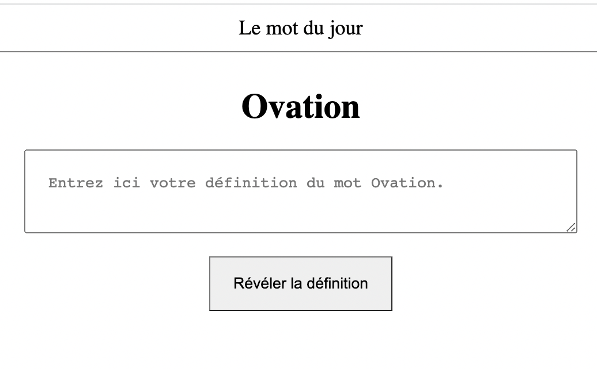

# LE MOT DU JOUR
Give your definition of the word of the day.



## First use
Install necessary node modules
```shell
npm install
```

## Usage
Build project
```shell
npm run build
```


Start server
```shell
live-server
```